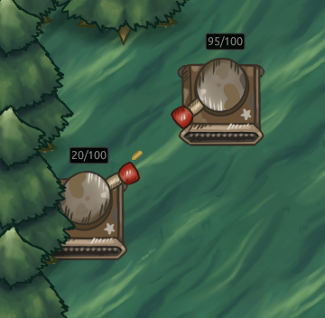

# Tank!
Top-down competitive multiplayer game made in Rust using Bevy

## Current usage
Download and boot up the client executable from our releases to play!

The client is capable of joining servers and hosting servers. If you would like to host a server
without joining as a client, you can use our server executable. You may pass the `headless` arg to
the server executable to run a lightweight headless version as well.
Currently, the server executable defaults to hosting on port `1337`.

As the client you may host on any port that you'd like, and join servers by entering their address
(e.g. `127.0.0.1:1337`)

Very basic combat is implemented. You can shoot bullets at other connected players on the server and
that's about it (so far). Player's have their health displayed, there is a leaderboard noting kill
counts for each player, and players respawn at the least crowded spawn location after 5 seconds.

Matches currently last for 5 minutes, and after 10 seconds matches restart. Players can join and disconnect at any time.

Next steps are:
- Switch Network protocols for once that more easily allows matchmaking (matchbox?) and more friendly UI for hosting and joining servers.
- More complex movement options such as boosting, dodging, shielding

Further into the future, this project will have:
- Leveling up
- Equip skills dropped from other players/from leveling up
  - implement movement options/shielding via skills
  - Bouncing bullets
  - Stat increases
